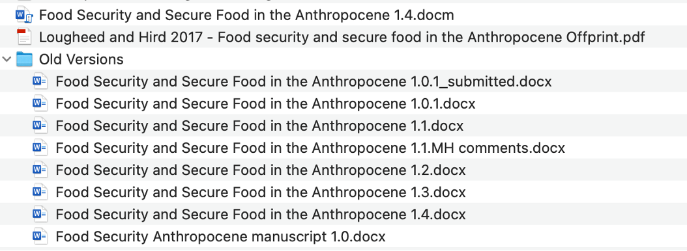
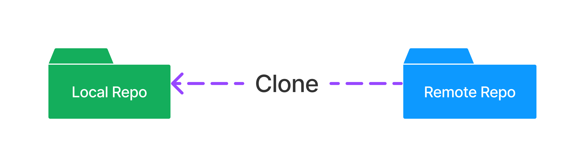
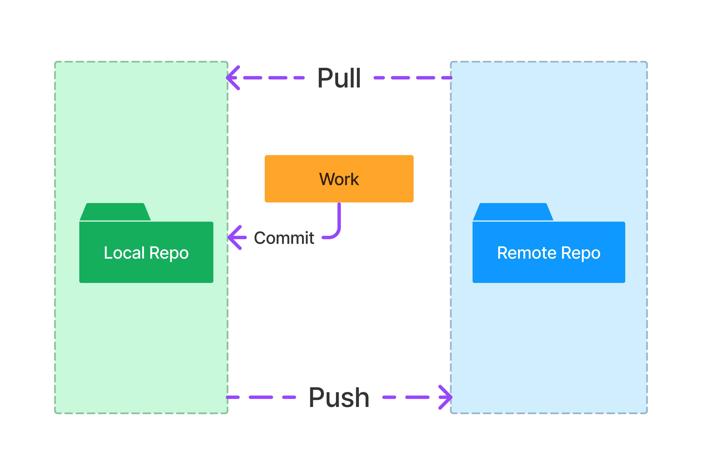

```{r setup, include=FALSE}
knitr::opts_chunk$set(echo = FALSE)
```

## What is Git?


## What is Git? { .vcenter}

* Version control system
* Automatic
* History is immutable
* All changes are attributable
* Easy comparisons (“diffing”)
* Roll back one, some, or all changes

## Key Concepts

* Repository (“repo”)
* Cloning
* Commit
* Push
* Fetch/Pull

## Repository
A collection of related files to be managed together. 

* Files related to a single project
* Canonical version typically lives online
* You do your work on a local copy of the repo

## Cloning
Creates a repo from "remote" to "local"

* Typically only necessary once

## Commit
Creates a snapshot of all files in the repo

* Commits are to your local copy.
* Commit any time you do "meaningful" work.

## Push
Pushes changes to the remote repo and merges your changes with those made by your collaborators.

* Do this when you are finished working for the day.
* Ensures your collaborators see your changes.
* Your entire commit history is also pushed.
* Backs up your work remotely. 

## Fetch/Pull
Retrieves the latest changes from the remote repo and merges them with your local copy.

* You get all changes and history others have committed and pushed.
* Their changes merged with yours. 
* Github app says "Fetch" and may automatically pull, or may suggest you pull. 
* (Behind the scenes, Pull performs a Fetch command, then a Merge command)

## Getting a repo on your computer
To work on a repository, you must **Clone** the repository. 

This creates a local copy of the repository. Typically you only need to clone once. 
<br />


## Daily workflow { .flexbox .vcenter}


## When to fetch/pull, commit, and push?

* Pull when you start working.
* Commit regularly.
  * Any time you have something you can describe
  * E.g., "added placeholder function"
  * E.g., "preliminary attempt at variable transformation function"
* Push when done working for the time being. 

## Let's give it a try, part 1
* Clone the repo.
* Create a new R Markdown file.
* Write your name and a TV show you'd recommend to a friend. 
* Save the file in /tv-project with your first name as the filename (e.g., `scott.Rmd`).
* Commit, make sure to add a description like "Added recommendation"
* Push to remote.

## Let's give it a try, part 2
* Pull.
* Open the `.Rmd` of the person whose name is next in the alphabet to your own.
* Write "I have seen it!" or "I haven't seen it!" below their recommendation. 
* Commit, make sure to add a descriptoin like "Reviewed recommendation".
* Push to remote. 